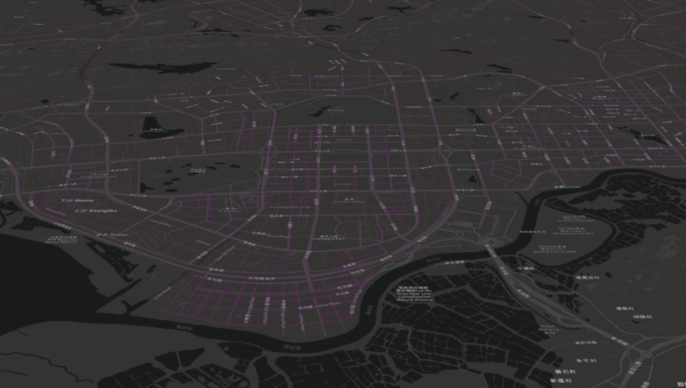

# mapbox tiles server

`将 mbtiles 数据，发布为 pbf 或 png (本例子中仅发布png), scheme 为 xyz`


## 数据说明
+ mbtiles 数据生成方法可以使用工具`mapbox/tippecanoe`，或者通过`QGIS`的插件`qtiles`生成 (QGIS 2.x.x版本才有这个插件，3.0版本以上没找到)
+ 把数据拷入data文件夹或者路径直接指向 mbtiles 数据，本例子中使用了一个`test.mbtiles`数据，数据太大没有上传

## 启动方式
```
npm i
npm start
```
**打开链接:** http://localhost:7777/

## 切片访问方式

```html
http://localhost:7777/data/tiles/{z}/{x}/{y}.png
```


